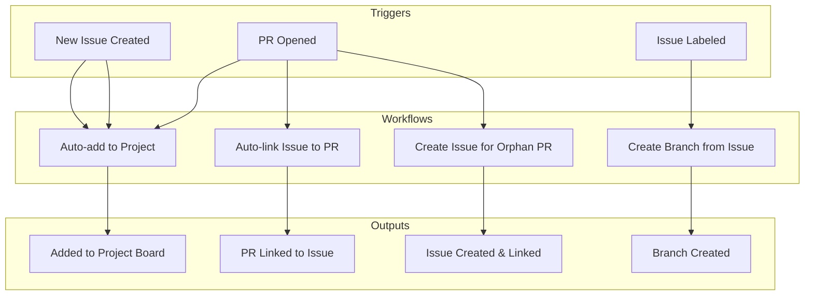
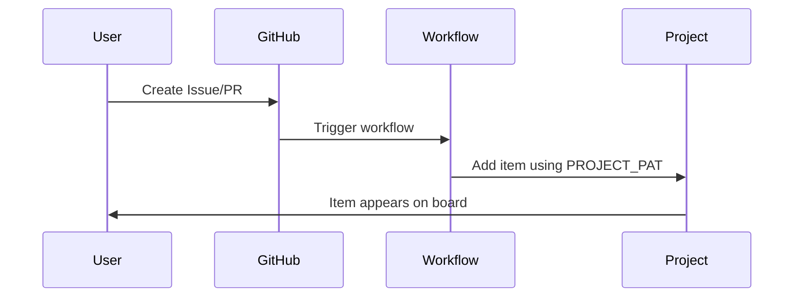
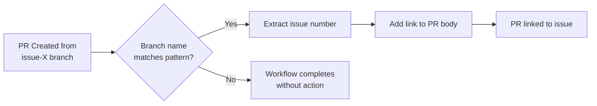
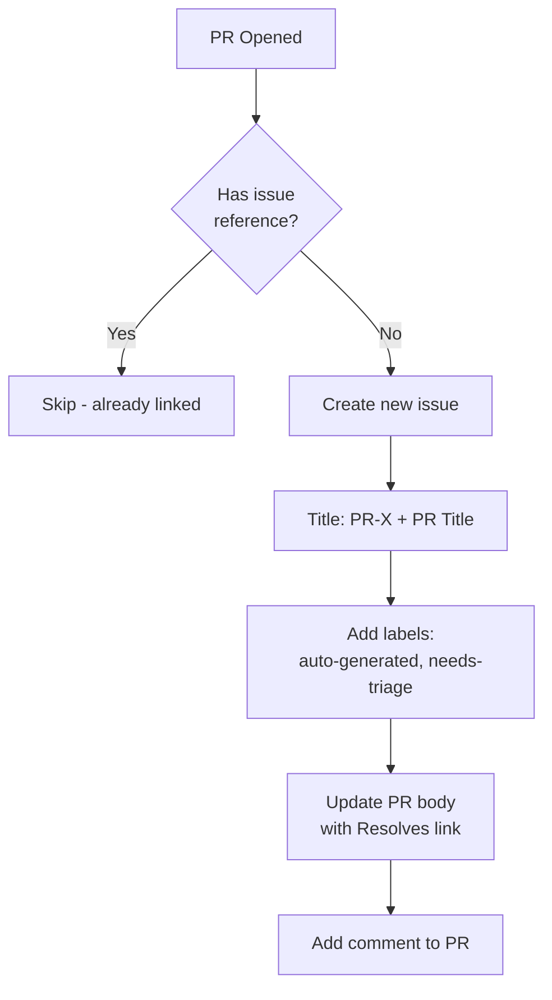
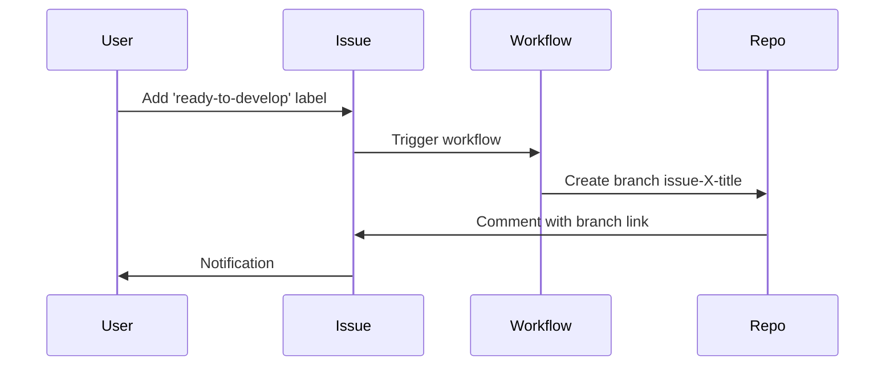
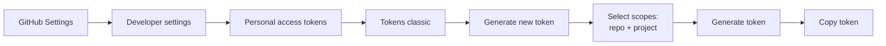
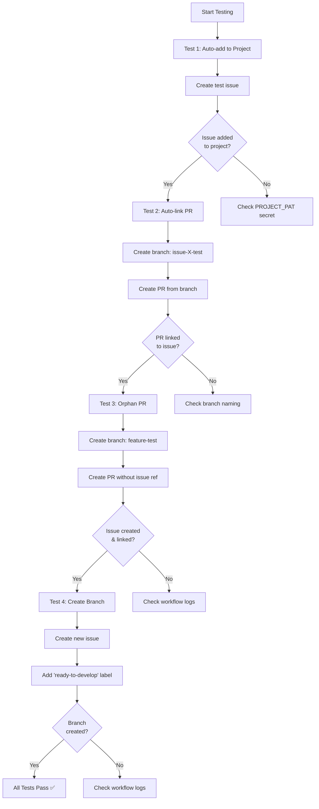
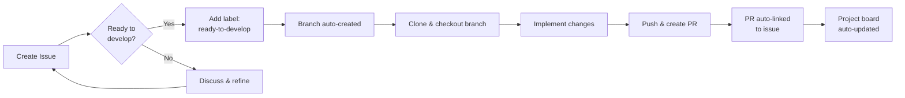

# GitHub Workflow Automation Documentation

## Overview

This repository implements automated GitHub workflow management through four key workflows that streamline issue tracking, branch creation, and PR management.

## Architecture



## Workflow Details

### 1. Auto-add to Project

**Purpose:** Automatically adds new issues and PRs to a GitHub Project board.

**Trigger:** When an issue or PR is opened or labeled

**Dependencies:**
- GitHub Action: `actions/add-to-project@v1.0.2`
- Secret: `PROJECT_PAT` (Classic Personal Access Token)

**Flow:**


### 2. Auto-link Issue to PR

**Purpose:** Automatically links PRs to issues based on branch naming convention.

**Trigger:** When a PR is opened, edited, or synchronized

**Branch Naming Pattern:** `issue-{number}-{description}`
- Example: `issue-123-fix-login-bug`

**Dependencies:**
- GitHub Action: `tkt-actions/add-issue-links@v1.8.1`
- Token: Built-in `GITHUB_TOKEN`

**Flow:**


### 3. Create Issue for Orphan PR

**Purpose:** Automatically creates and links an issue for PRs that don't reference any existing issue.

**Trigger:** When a PR is opened

**Detection Logic:** Checks for issue references in:
- PR title
- PR body
- Branch name

**Patterns Detected:**
- `#123`
- `issue-123`
- `resolves #123`
- `fixes #123`
- `closes #123`

**Dependencies:**
- GitHub Action: `actions/github-script@v7`
- Token: Built-in `GITHUB_TOKEN`

**Flow:**


### 4. Create Branch from Issue

**Purpose:** Automatically creates a development branch when an issue is ready for work.

**Trigger:** When an issue is labeled with `ready-to-develop`

**Branch Naming:** Automatically generates: `issue-{number}-{slugified-title}`

**Dependencies:**
- GitHub Action: `robvanderleek/create-issue-branch@v1.6.0`
- Token: Built-in `GITHUB_TOKEN`

**Flow:**


## Installation Guide

### Prerequisites

1. GitHub repository with admin access
2. GitHub Project board (user or organization level)
3. Repository must have Actions enabled

### Step 1: Create GitHub Project

1. Navigate to GitHub Projects
2. Create a new project (e.g., "Development Tracker")
3. Note the project number from the URL: `https://github.com/users/{username}/projects/{NUMBER}`

### Step 2: Create Personal Access Token (Classic)



**Detailed Steps:**

1. Go to GitHub Settings → Developer settings → Personal access tokens → Tokens (classic)
2. Click "Generate new token (classic)"
3. Token name: e.g., `workflow-automation`
4. Select scopes:
   - ✅ `repo` (Full control of private repositories)
   - ✅ `project` (Full control of projects)
5. Click "Generate token"
6. **Copy the token immediately** (you won't see it again!)

### Step 3: Add Token to Repository Secrets

1. Go to your repository: Settings → Secrets and variables → Actions
2. Click "New repository secret"
3. Name: `PROJECT_PAT`
4. Value: Paste your copied token
5. Click "Add secret"

### Step 4: Create Workflow Directory

```bash
mkdir -p .github/workflows
```

### Step 5: Add Workflow Files

Create the following four files in `.github/workflows/`:

#### `auto-add-to-project.yml`
```yaml
name: Auto-add to Project

on:
  issues:
    types: [opened, labeled]
  pull_request:
    types: [opened, labeled]

jobs:
  add-to-project:
    runs-on: ubuntu-latest
    permissions:
      issues: read
      pull-requests: read
      repository-projects: read
    steps:
      - name: Add to project
        uses: actions/add-to-project@v1.0.2
        with:
          project-url: https://github.com/users/{USERNAME}/projects/{NUMBER}
          github-token: ${{ secrets.PROJECT_PAT }}
```

**⚠️ Replace `{USERNAME}` and `{NUMBER}` with your values**

#### `auto-link-issue.yml`
```yaml
name: Auto-link Issue to PR

on:
  pull_request:
    types: [opened, edited, synchronize]

jobs:
  link-issue:
    runs-on: ubuntu-latest
    steps:
      - name: Link issue from branch name
        uses: tkt-actions/add-issue-links@v1.8.1
        with:
          branch-prefix: 'issue-'
          link-style: body
          resolve: true
        env:
          GITHUB_TOKEN: ${{ secrets.GITHUB_TOKEN }}
```

#### `create-issue-for-orphan-pr.yml`
```yaml
name: Create Issue for Orphan PR

on:
  pull_request:
    types: [opened]

jobs:
  check-and-create-issue:
    runs-on: ubuntu-latest
    permissions:
      issues: write
      pull-requests: write
    steps:
      - name: Check for linked issue and create if needed
        uses: actions/github-script@v7
        with:
          github-token: ${{ secrets.GITHUB_TOKEN }}
          script: |
            const pr = context.payload.pull_request;
            const prNumber = pr.number;
            const prTitle = pr.title;
            const prBody = pr.body || '';
            const branchName = pr.head.ref;
            
            // Check for issue references in various places
            const issuePatterns = [
              /#\d+/,                          // #123
              /issue-\d+/i,                    // issue-123 in branch name
              /resolves\s+#\d+/i,              // resolves #123
              /fixes\s+#\d+/i,                 // fixes #123
              /closes\s+#\d+/i                 // closes #123
            ];
            
            const hasIssueReference = issuePatterns.some(pattern => 
              pattern.test(prTitle) || pattern.test(prBody) || pattern.test(branchName)
            );
            
            if (hasIssueReference) {
              console.log('PR already has issue reference, skipping auto-creation');
              return;
            }
            
            // Create issue for orphan PR
            console.log('No issue reference found, creating issue for orphan PR');
            
            const issue = await github.rest.issues.create({
              owner: context.repo.owner,
              repo: context.repo.repo,
              title: `[PR-${prNumber}] ${prTitle}`,
              body: `This issue was automatically created for PR #${prNumber}\n\n${prBody}`,
              labels: ['auto-generated', 'needs-triage']
            });
            
            console.log(`Created issue #${issue.data.number}`);
            
            // Update PR body to link to new issue
            const updatedBody = `Resolves #${issue.data.number}\n\n${prBody}`;
            
            await github.rest.pulls.update({
              owner: context.repo.owner,
              repo: context.repo.repo,
              pull_number: prNumber,
              body: updatedBody
            });
            
            // Add comment to PR
            await github.rest.issues.createComment({
              owner: context.repo.owner,
              repo: context.repo.repo,
              issue_number: prNumber,
              body: `🤖 Auto-created issue #${issue.data.number} for this PR since no issue reference was found.`
            });
```

#### `create-branch-from-issue.yml`
```yaml
name: Create Branch from Issue

on:
  issues:
    types: [labeled]

jobs:
  create-branch:
    runs-on: ubuntu-latest
    if: github.event.label.name == 'ready-to-develop'
    steps:
      - name: Create issue branch
        uses: robvanderleek/create-issue-branch@v1.6.0
        env:
          GITHUB_TOKEN: ${{ secrets.GITHUB_TOKEN }}
```

### Step 6: Commit and Push

```bash
git add .github/workflows/
git commit -m "Add GitHub workflow automation

Co-Authored-By: Warp <agent@warp.dev>"
git push
```

## Deployment & Testing

### Test Plan



### Test 1: Auto-add to Project

**Steps:**
1. Create a new issue with any title
2. Check GitHub Actions tab for workflow run
3. Verify issue appears in project board

**Expected Result:** Issue automatically added to project

### Test 2: Auto-link PR to Issue

**Steps:**
```bash
# From existing issue #1
git checkout -b issue-1-test-feature
echo "test" >> README.md
git add README.md
git commit -m "Test feature for issue #1"
git push -u origin issue-1-test-feature
# Create PR on GitHub
```

**Expected Result:** PR body updated with link to issue #1

### Test 3: Create Issue for Orphan PR

**Steps:**
```bash
git checkout main
git checkout -b feature-without-issue
echo "orphan feature" >> README.md
git add README.md
git commit -m "Add orphan feature"
git push -u origin feature-without-issue
# Create PR on GitHub without mentioning any issue
```

**Expected Results:**
- New issue created automatically
- Issue title: `[PR-X] {PR Title}`
- Issue has labels: `auto-generated`, `needs-triage`
- PR body updated with `Resolves #X`
- Comment added to PR

### Test 4: Create Branch from Issue

**Steps:**
1. Create a new issue: "Implement user authentication"
2. Add label: `ready-to-develop`
3. Check repository branches

**Expected Results:**
- Branch created: `issue-X-implement-user-authentication`
- Comment added to issue with branch link

## Usage Guidelines

### Branch Naming Convention

For automatic PR-to-issue linking, use this pattern:

```
issue-{number}-{brief-description}
```

**Examples:**
- `issue-42-fix-login-bug`
- `issue-123-add-user-profile`
- `issue-7-update-documentation`

### Label Strategy

| Label | Purpose | Automation Trigger |
|-------|---------|-------------------|
| `ready-to-develop` | Issue is ready for implementation | Creates branch automatically |
| `auto-generated` | Item created by automation | Applied to orphan PR issues |
| `needs-triage` | Requires team review | Applied to orphan PR issues |

### Workflow Integration



## Troubleshooting

### Issue: Workflow not triggering

**Check:**
1. Actions enabled: Repository Settings → Actions → Allow all actions
2. Workflow file syntax is correct (valid YAML)
3. Push workflows to `main` or default branch

### Issue: Auto-add to project fails

**Solutions:**
1. Verify `PROJECT_PAT` secret exists and is correctly named
2. Verify token has `repo` and `project` scopes
3. Update `project-url` in workflow file with correct URL
4. Check token hasn't expired

### Issue: Auto-link not working

**Solutions:**
1. Verify branch name matches pattern: `issue-{number}-*`
2. Ensure issue number exists in repository
3. Check workflow logs in Actions tab

### Issue: Branch not created from issue

**Solutions:**
1. Verify label name is exactly `ready-to-develop`
2. Check workflow logs for errors
3. Ensure `GITHUB_TOKEN` has required permissions

## Maintenance

### Updating Workflows

When modifying workflow files:

1. Test changes in test repository first
2. Update documentation to reflect changes
3. Notify team of new behavior
4. Monitor Actions tab after deployment

### Token Rotation

Classic PATs should be rotated periodically:

1. Generate new token with same permissions
2. Update `PROJECT_PAT` secret in all repositories
3. Delete old token from GitHub settings

### Monitoring

Regularly check:
- Actions tab for failed workflows
- Project board for missing items
- Issues for proper labeling
- Token expiration dates

## Migration to Production

### Checklist

- [ ] Test all four workflows in test repository
- [ ] Create production project board
- [ ] Generate production PAT token
- [ ] Add `PROJECT_PAT` to production repository secrets
- [ ] Update `project-url` in `auto-add-to-project.yml`
- [ ] Copy all four workflow files to production `.github/workflows/`
- [ ] Commit and push changes
- [ ] Run smoke tests on production
- [ ] Document any production-specific configurations
- [ ] Train team on new workflows

### Production Deployment

```bash
# 1. Copy workflows to production repo
cp -r .github/workflows/* /path/to/production/repo/.github/workflows/

# 2. Update project URL in auto-add-to-project.yml
# Edit the file and replace with production project URL

# 3. Commit changes
cd /path/to/production/repo
git add .github/workflows/
git commit -m "Deploy GitHub workflow automation

Co-Authored-By: Warp <agent@warp.dev>"
git push

# 4. Verify in GitHub Actions tab
```

## Dependencies

| Workflow | Action | Version | Purpose |
|----------|--------|---------|---------|
| Auto-add to Project | `actions/add-to-project` | v1.0.2 | Adds items to project board |
| Auto-link Issue | `tkt-actions/add-issue-links` | v1.8.1 | Links PRs to issues via branch name |
| Orphan PR | `actions/github-script` | v7 | Executes custom JavaScript logic |
| Create Branch | `robvanderleek/create-issue-branch` | v1.6.0 | Creates branches from issues |

## Security Considerations

### Token Security

- **Never commit tokens** to repository
- Use repository secrets for all tokens
- Use classic PATs (fine-grained tokens don't support Projects yet)
- Rotate tokens regularly (recommended: every 90 days)
- Use minimum required scopes

### Permissions

Each workflow declares minimum required permissions:

```yaml
permissions:
  issues: read/write
  pull-requests: read/write
  repository-projects: read
```

### Audit

Monitor workflow usage:
- Actions tab → Workflow runs
- Check for unexpected behavior
- Review auto-generated issues/PRs
- Validate project board integrity

## Support & References

### Documentation Links

- [GitHub Actions Documentation](https://docs.github.com/en/actions)
- [GitHub Projects Documentation](https://docs.github.com/en/issues/planning-and-tracking-with-projects)
- [Personal Access Tokens](https://docs.github.com/en/authentication/keeping-your-account-and-data-secure/managing-your-personal-access-tokens)

### Team Integration

Integrate with PF-Core agent system by adding agent labels:
- `cluster:discovery`
- `cluster:analysis`
- `cluster:generation`
- `cluster:optimization`
- `agent:oaa`
- `agent:vp-generator`

Filter project board views by agent responsibility for better organization.
